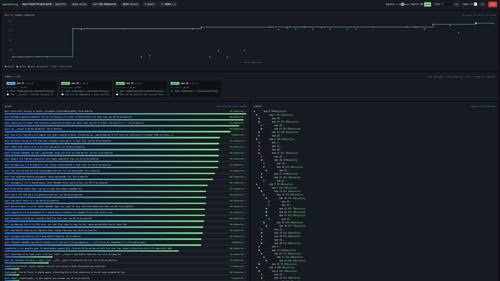

# kernelthing

A kernel optimization autoresearch loop built on top of [`opencode`](https://github.com/sst/opencode) and DeepSeek V4.

Iteratively improves a GPU kernel, scoring every attempt against a known-correct
baseline and keeping only genuine improvements. Originally a DSV4/Opencode
reimplementation of [Humanize](https://github.com/PolyArch/humanize), but now
is rather different and has many more features.

<br>



## Setup

```bash
python -m pip install -e .
git submodule update --init # fetch vendored KernelWiki + ncu-report-skill

# external prerequisites
opencode --version     # CLI agent on PATH + DEEPSEEK_API_KEY
bwrap --version        # bubblewrap sandbox
nvcc --version         # CUDA compiler (for problems/gemm)
# As well as whatever else your kernels might need.
```

## Quick start

```bash
kernelthing                                                  # Jump into an opencode session to define a new problem interactively
kernelthing -j 8                                             # Launch with 8 concurrent agents working on improving kernels
kernelthing problems/gemm -j 8                               # opens web UI at localhost:8765
kernelthing problems/gemm --max-candidates 50                # headless, set budgets
```

Running without `--no-web` will open a WebUI at [http://localhost:8765](http://localhost:8765) from which to view progress and tweak parameters.


## Targeting your own problem

A **problem** is a directory inside a git repo with a `problem.json` manifest:

```json
{
  "name": "my-kernel",
  "plan": "plan.md",
  "edit_files": ["kernels/mykernel.cu"],
  "score_command": "bash score.sh",
  "metric_name": "pct_baseline", "unit": "%baseline",
  "direction": "maximize", "bench_runs": 3
}
```

You can write it manually, or have the agent write it on launch. Having the agent write it is recommended.

### Score scripts must benchmark honestly

A single timed run is not a measurement. The bundled `problems/gemm` harness shows
the bar: **multi-seed correctness**, **steady-state warmup**, an **L2-cache flush
between timed iterations**, and **median of many iters with min/max spread**.
kernelthing additionally re-runs your score command `bench_runs` times and keeps only
the best of all-correct runs. Hold your own problems to the same standard.

## Web UI

`http://127.0.0.1:<port>` (stdlib-only, zero deps). The UI is fully decoupled
from the run: every run journals everything it does to its run dir
(`.humanize/rlcr/<ts>/` — `run.json`, an append-only `events.ndjson`, and
`members/<id>/` with each candidate's exact prompt, agent transcript, diff,
summary, and result/cost record), and the server is a pure reader of those
dirs. The run picker lists every run — live or finished — so old runs replay
with the full chart/lineage/leaderboard, and `events.ndjson` can be debugged
with `tail`/`grep`/`jq`.

- **Best vs. submitted** — best-so-far staircase chart with each attempt a dot
  colored by operator (explore/exploit), failures marked.
- **Agents (live)** — cards showing operator, parent, tool-call count, cost, and
  the latest tool call + reasoning line from the streaming opencode log. Click for
  full transcript.
- **Lineage** (parent→child mutation tree), **Leaderboard** (with per-candidate
  cost), and a **member detail pane** (transcript / prompt / diff / summary /
  result).
- Live-tunable controls (parallelism, budgets, explore bias, stop) flow through
  the run dir's `control.json`, re-read by the loop at dispatch boundaries —
  only shown while the run holds its `live.lock`.

Disable with `--no-web`, or serve all runs standalone (no loop needed) with
`kernelthing web [--root ~/.cache/kernelthing]`.

## Search strategy: 

The search strategy is the biggest difference between kernelthing and humanize. Humanize takes an RLCR approach.
We take an async evolutionary population approach. This allows us to separate parallel tasks like code editing from
tasks like benchmarking, and allows us to maintain idea diversity.

- a **controller** owns the population/archive and a task queue;
- a pool of **mutation workers** (many, concurrent) each take a parent + operator,
  edit in an isolated worktree, and submit the result;
- **all GPU access is serialized** by a per-device lock — not just the
  authoritative benchmark, but every agent's own build/run/profile too.

Results flow back continuously, so the GPU is always fed and agents always working.

**Two operators**, with compute budget split across them:

| Operator | Purpose | How |
|---|---|---|
| **Explore** (breadth) | new lineages | start from a seed, take a strategy *not yet in the archive* |
| **Exploit** (depth) | deepen winners | refine a top scoring commit |

**Diversity via MAP-Elites** niches keyed on agent-reported strategy descriptors
(tiling, vectorization, tensor-core use, …): the best kernel *per niche* is kept,
and exploration targets empty niches so the search can't collapse onto one lineage.

**The measured benchmark is the only thing that decides what is elite or gets promoted.** The run stops on a global budget (wall-clock / candidate count), not a
round count. `-j` sets max concurrent agents; all GPU work stays serialized.

**Automatic GPU allocation.** Access to the GPU pool is mediated by a per-device
`flock` keyed on the physical GPU **UUID** (not the CUDA index, which is relative to
each process's `CUDA_VISIBLE_DEVICES`); lockfiles are named in `kernelthing/gpupool.py`.
All locking happens transparently in an `LD_PRELOAD` shim (`kernelthing/native/ktgpu.c`
→ `libktgpu.so`) injected into every spawned process — agents and the benchmark's
worker alike: on the first CUDA call, the shim flocks a free card from the pool, pins
`CUDA_VISIBLE_DEVICES` to it for that process's lifetime, and blocks only if every
card is busy. Purely CPU commands
never trigger it, so builds and analysis don't hold a GPU. There is no wrapper for the
agent to remember and nothing to opt into — and the guard blocks any attempt to set
`CUDA_VISIBLE_DEVICES`/`LD_PRELOAD` or otherwise touch the mechanism, so an agent can't
grab an unlocked card. Nothing ever contends on a device, even across separate
kernelthing processes. `--gpu N` (repeatable) sets the pool.

## Sandboxing

Every edit-capable agent runs under **bubblewrap**: filesystem read-only except the
candidate's worktree, opencode's own state, and `/tmp`; GPU device nodes and the pool's
lock files bound through; `CUDA_VISIBLE_DEVICES` empty by default (fail-closed) so a
card is reachable only via the lock shim. Network stays up (the model API needs it);
the filesystem is the confinement boundary. opencode's `--dangerously-skip-permissions`
is only safe because of this.

## Kernel tooling (KernelWiki + ncu profiling)

Two vendored [KDA](https://github.com/mit-han-lab/kernel-design-agents) skills
(git submodules under `vendor/`), injected into the agent's prompt:

- **KernelWiki** (`vendor/KernelWiki`) — Blackwell/Hopper kernel-optimization
  knowledge base (read-only query).
- **ncu-report-skill** (`vendor/ncu-report-skill`) — Nsight Compute profiling
  workflow.

Disable with `--no-wiki` / `--no-ncu`.

## GPU profiling permission (for ncu)

NVIDIA drivers restrict performance counters to admins by default. The agent runs
non-root under bubblewrap (which sets `no_new_privs`), so profiling fails with
`ERR_NVGPUCTRPERM` until you allow non-root access:

```bash
echo 'options nvidia NVreg_RestrictProfilingToAdminUsers=0' \
  | sudo tee /etc/modprobe.d/nvidia-profiling.conf
sudo reboot
```

Verify: `cat /proc/driver/nvidia/params | grep Profiling` → `RmProfilingAdminOnly: 0`.
Run with `--no-ncu` to skip profiling entirely.
